# Practice Azure CustomVision AI
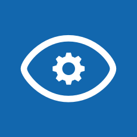

----------------------------------------------------------------
##### -Go to this [URL]([C:\xampp\htdocs\InnovaccionVirtual\practice-azure-customvision-AI\img\1-cv.png](https://www.customvision.ai/projects)) and click on SING IN.
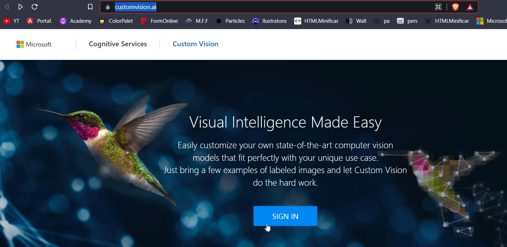.
##### -Click on new project.
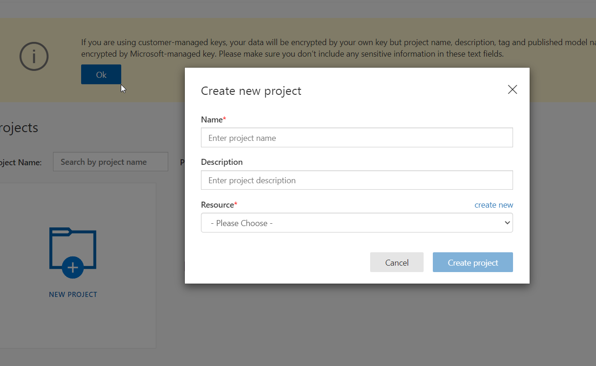
##### -Click on create a new resource group or you can select a resource group created.
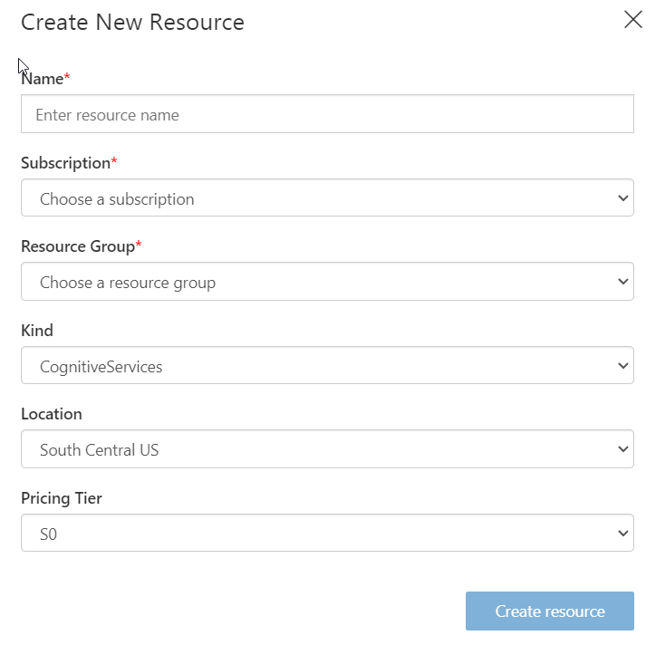
##### -In kind choose CognitveServices and click on create.
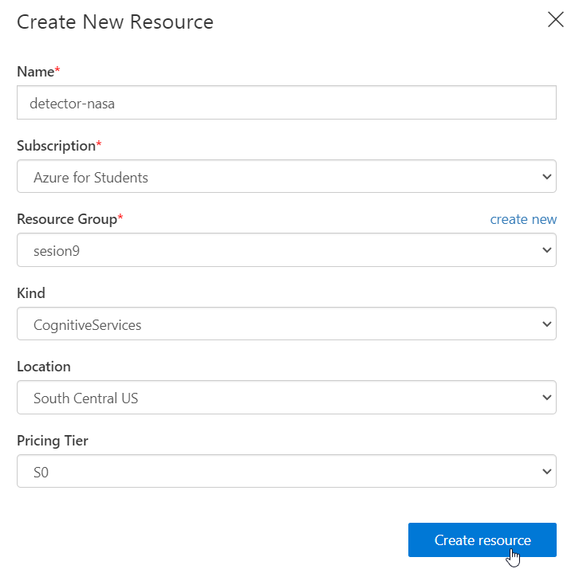
##### -Now, se can select our resource group previously created.
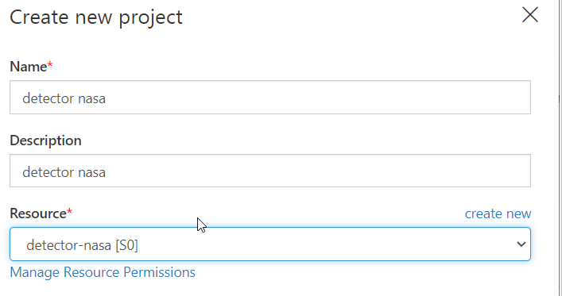
##### -Choose the following options and create project.
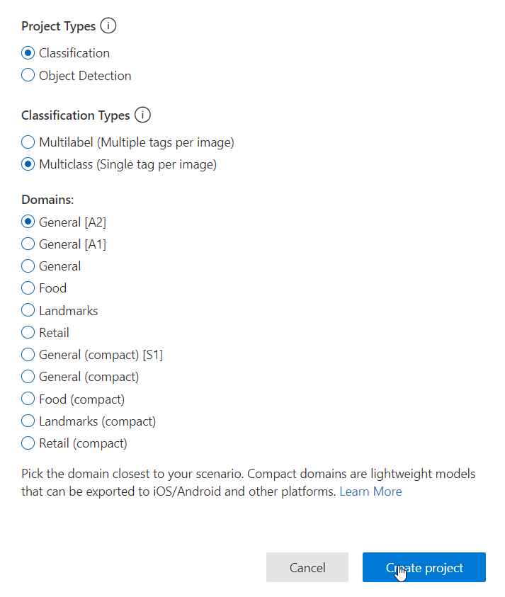
##### -Click on update images, we can update 1 or more pictures, so in this case, we go to choose galaxy images, in tag, write galaxies or galaxy how you want.
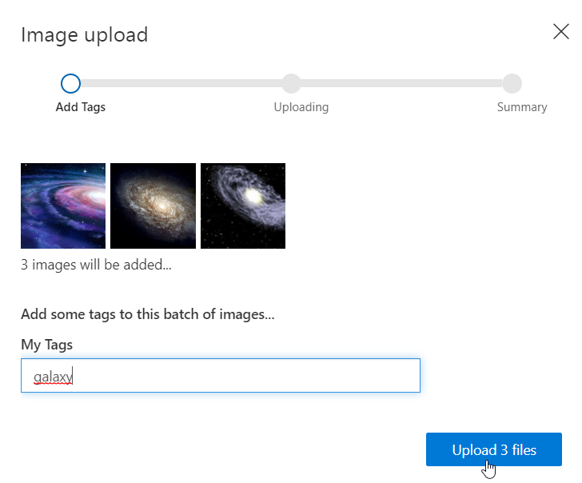
##### -All right.
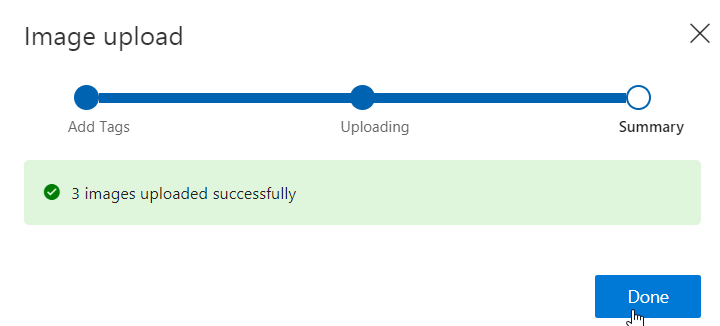
##### -We have to update more pictures, in this case, nebulae.
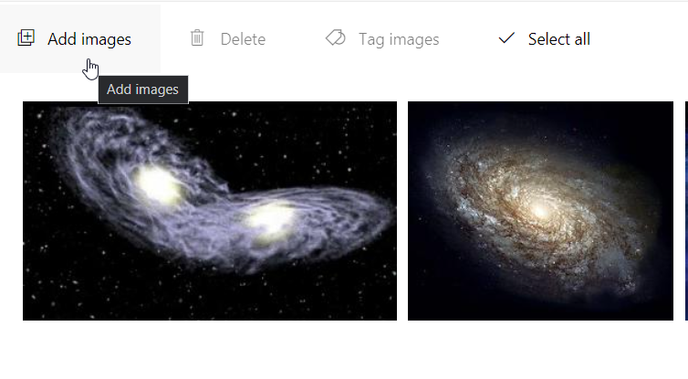
##### -Now, we have galaxies and nebulae.
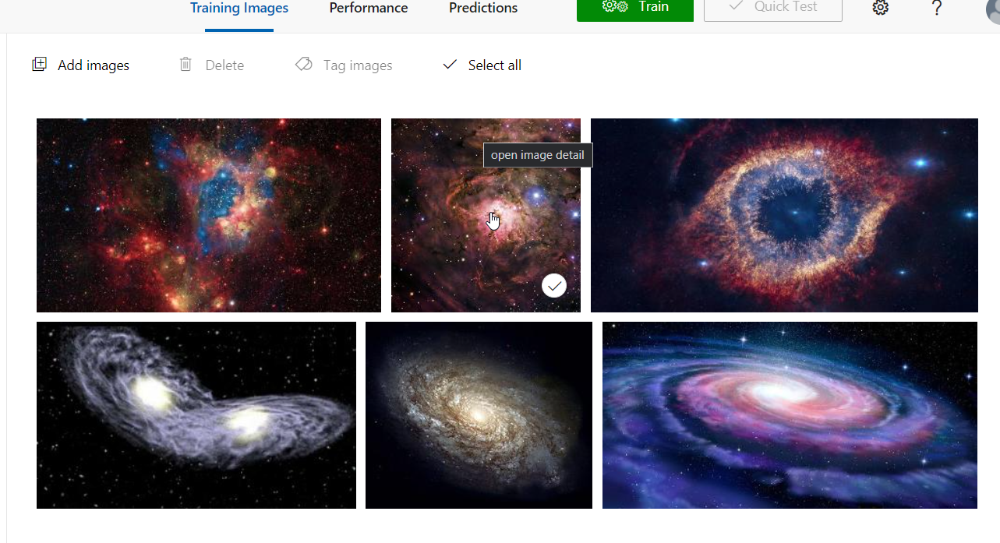
##### -We have to repeat the process, but now we have to update planets
----------------------------------------------------------------
##### -We go to choose stars pictures, but in the tag, select -negative.
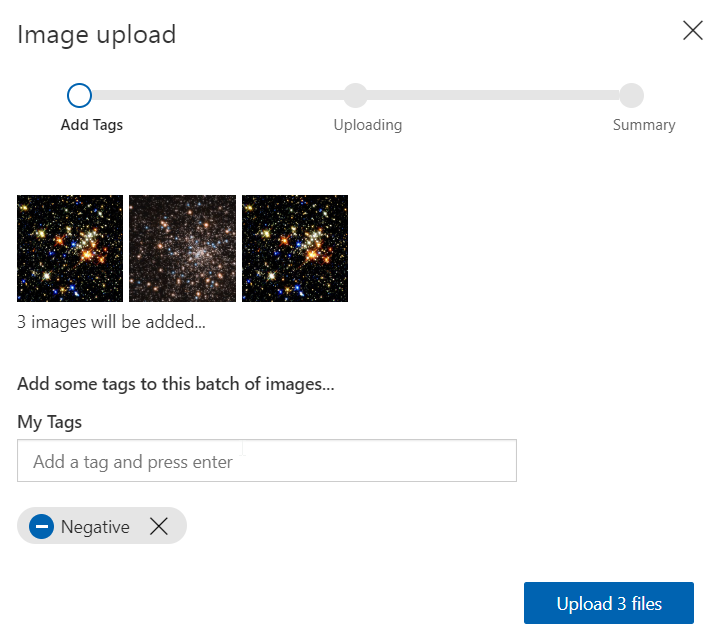
##### -Then, click on train and choose quick training.
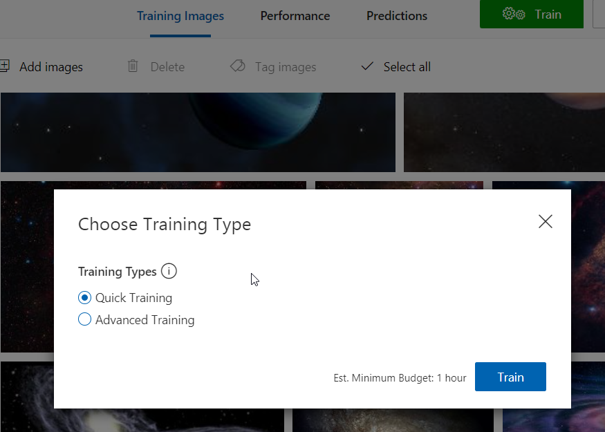
##### -We can see the information.
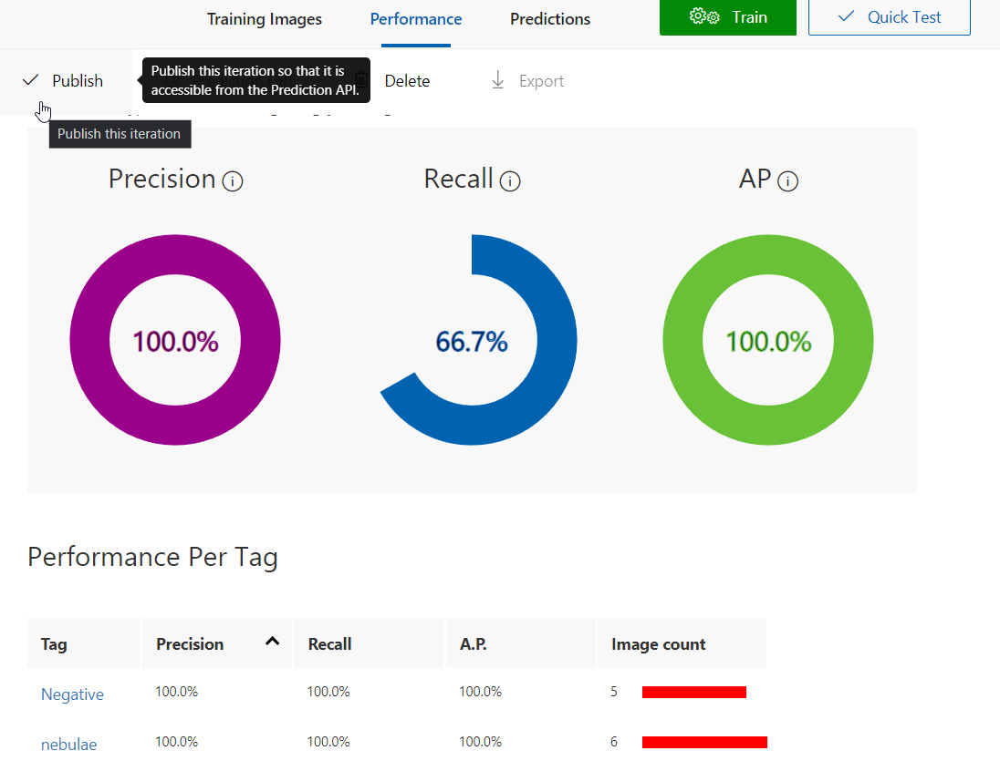
##### -Search an image, like this, and copy the direction.
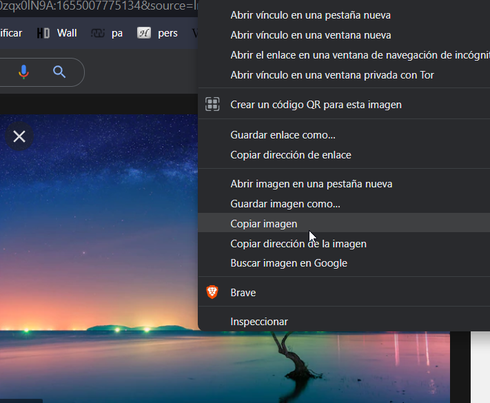
##### -Click n quick test.
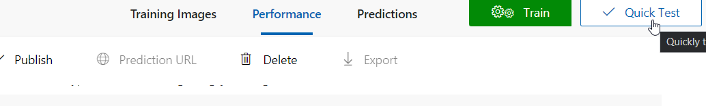
##### -We can see below the probability, if is a galaxy, nebulae, planet, or nothing.
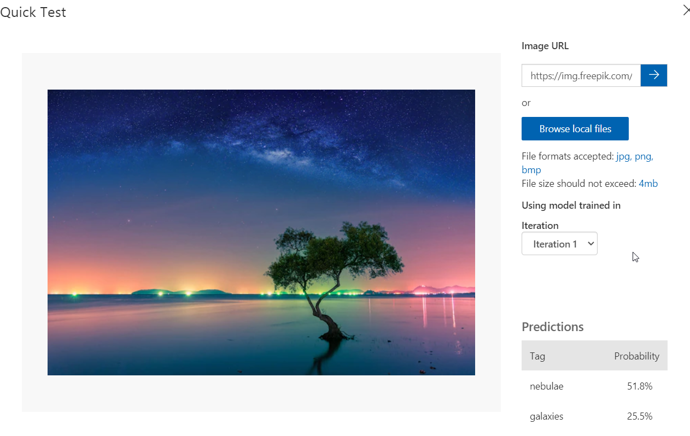
## 🔥🔥congratulations you used body detection with AI🔥🔥
